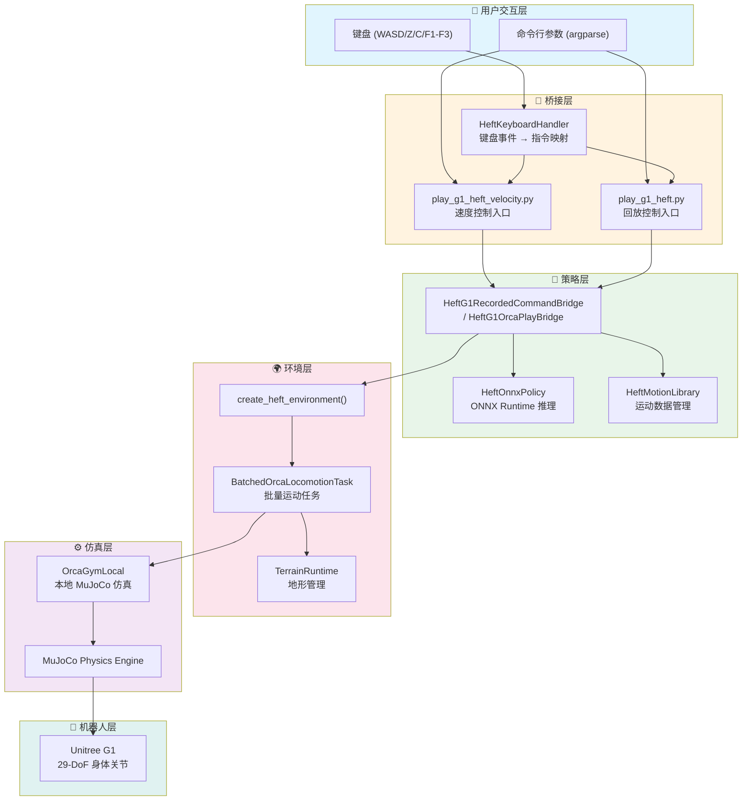
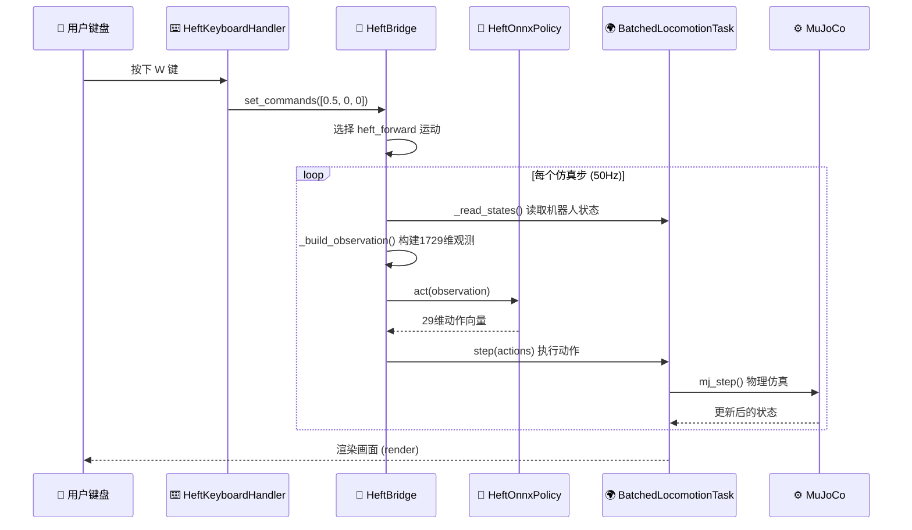
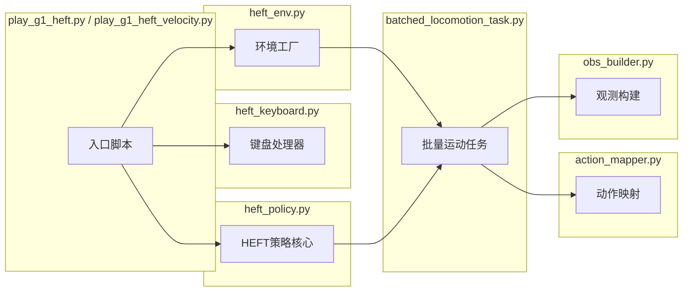
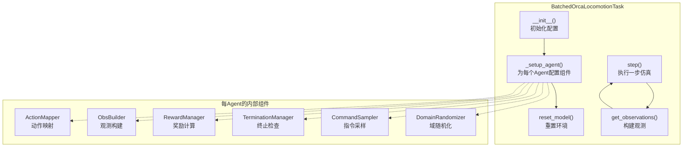
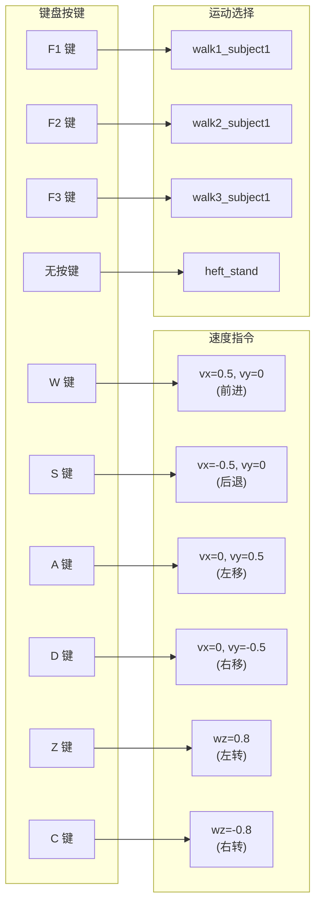
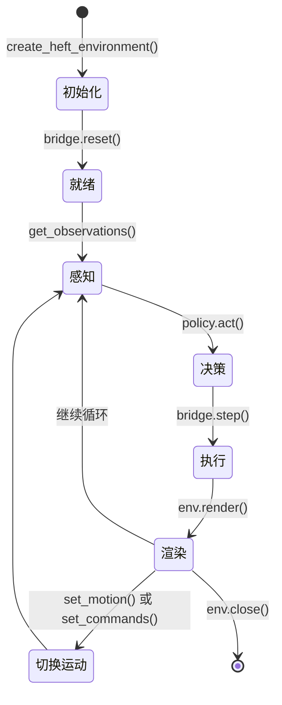

# OrcaLocomotion HEFT 培训手册

> **版本**: v1.0 | **适用分支**: `master` | **适用机器人**: Unitree G1

---

## 目录

1. [项目总览](#1-项目总览)
2. [系统架构](#2-系统架构)
3. [环境准备与安装](#3-环境准备与安装)
4. [核心模块详解](#4-核心模块详解)
5. [运行流程 Step-by-Step](#5-运行流程-step-by-step)
6. [键盘交互操作指南](#6-键盘交互操作指南)
7. [HEFT 策略详解](#7-heft-策略详解)
8. [Agent 生命周期与数据流](#8-agent-生命周期与数据流)
9. [排障指南](#9-排障指南)
10. [进阶：自定义扩展](#10-进阶自定义扩展)

---

## 1. 项目总览

### 1.1 项目定位

**OrcaLocomotion** 是一个基于强化学习的人形机器人运动控制项目，专为 **Unitree G1** 人形机器人设计。它能够在 OrcaLab/OrcaStudio 仿真环境中，通过 HEFT（Humanoid Efficient Fast Tracker）策略模型，实现对机器人的实时运动控制。

```
┌─────────────────────────────────────────────────────────────┐
│                    OrcaLocomotion HEFT                       │
│                                                             │
│   ┌─────────┐     ┌──────────────┐     ┌────────────────┐  │
│   │ 键盘输入 │ ──▶ │ HEFT ONNX    │ ──▶ │ MuJoCo 仿真器   │  │
│   │ (WASD)  │     │ 神经网络策略  │     │ (OrcaLab/Gym)  │  │
│   └─────────┘     └──────────────┘     └────────────────┘  │
│                          │                      │           │
│                    ┌─────▼──────┐               │           │
│                    │ 运动库参考 │               │           │
│                    │ (.npz 文件)│               │           │
│                    └────────────┘               │           │
│                                                ▼           │
│                               ┌────────────────────────┐   │
│                               │   G1 机器人 (29-DoF)    │   │
│                               └────────────────────────┘   │
└─────────────────────────────────────────────────────────────┘
```

### 1.2 核心能力

| 能力 | 描述 |
|------|------|
| **速度控制模式** | 通过速度指令控制机器人移动方向和速度 |
| **录制运动回放** | 播放预先录制的运动轨迹（前/后/左/右/旋转） |
| **走路动画播放** | 播放不同风格的行走动画（walk1/walk2/walk3） |
| **站立保持** | 默认站立姿态保持，自动切换 |
| **批量仿真** | 支持多环境并行仿真训练 |
| **手部兼容** | 手部执行器不进入策略控制，仅控制身体29个关节 |

### 1.3 目录结构

```
BinJiang_Unitree_g1_locomotion/
├── assets/                    # 运动捕捉数据 (.npz)
│   ├── heft_stand.npz         # 站立姿态
│   ├── heft_forward.npz       # 前进运动
│   ├── heft_backward.npz      # 后退运动
│   ├── heft_left.npz          # 左移运动
│   ├── heft_right.npz         # 右移运动
│   ├── heft_yaw_left.npz      # 左转运动
│   ├── heft_yaw_right.npz     # 右转运动
│   ├── walk1_subject1.npz     # 走路风格1
│   ├── walk2_subject1.npz     # 走路风格2
│   └── walk3_subject1.npz     # 走路风格3
├── checkpoints/               # 模型检查点
│   ├── heft_g1_pmg.onnx       # HEFT ONNX 策略模型
│   ├── heft_g1_pmg.onnx.data  # 模型外部权重数据
│   └── heft_g1_pmg.onnx.json  # 模型元数据（输出键名）
├── orca_rl/                   # 核心代码
│   ├── play_g1_heft.py        # 录制运动回放入口
│   ├── play_g1_heft_velocity.py # 速度控制入口
│   ├── heft_keyboard.py       # 键盘交互处理器
│   ├── heft_env.py            # HEFT 环境工厂
│   ├── utils.py               # 工具函数
│   └── rsl_env/               # RL 仿真环境模块
│       ├── heft_policy.py     # HEFT 策略核心（最重要）
│       ├── batched_locomotion_task.py # 批量运动任务
│       ├── action_mapper.py   # 动作映射器
│       ├── obs_builder.py     # 观测构建器
│       ├── reward_manager.py  # 奖励管理器
│       ├── termination_manager.py # 终止条件
│       ├── curriculum.py      # 课程学习/指令采样
│       ├── randomization.py   # 域随机化
│       ├── scene_binding.py   # 场景绑定
│       ├── model_scanner.py   # 模型扫描器
│       └── terrain_runtime.py # 地形运行时
├── scripts/                   # 辅助脚本
│   ├── smoke_test_heft.py     # 冒烟测试
│   └── check_heft_install.sh  # 安装检查
├── play_g1_heft.sh            # 回放模式启动脚本
├── play_g1_heft_velocity.sh   # 速度模式启动脚本
└── requirements.txt           # Python 依赖
```

---

## 2. 系统架构

### 2.1 分层架构图



### 2.2 数据流图



### 2.3 模块依赖关系



---

## 3. 环境准备与安装

### 3.1 前置依赖

| 依赖 | 版本要求 | 说明 |
|------|---------|------|
| Python | >= 3.10 | 推荐 3.10 或 3.11 |
| CUDA | 12.x (可选) | GPU 加速推理 |
| OrcaLab/OrcaStudio | - | 仿真环境服务 |
| MuJoCo | 3.x | 物理引擎 |

### 3.2 安装依赖

默认使用 `orca-loco` conda 环境（Python 3.12）：

```bash
# Step 1: 克隆项目
git clone --branch master <新仓库地址>
cd BinJiang_Unitree_g1_locomotion

# Step 2: 在 orca-loco 环境中安装依赖
conda run -n orca-loco pip install -r requirements.txt
conda run -n orca-loco pip install --no-deps -e .
```

**主要安装内容：**

```bash
# requirements.txt 包含：
# - PyTorch (CUDA 12.x)
# - orca-gym (MuJoCo 仿真后端)
# - onnxruntime (ONNX 推理引擎)
# - numpy, mujoco 等核心依赖
```

### 3.3 验证安装

```bash
# 检查安装是否成功（自动检测 orca-loco conda 环境）
bash scripts/check_heft_install.sh --runtime

# 运行冒烟测试
conda run -n orca-loco python scripts/smoke_test_heft.py
```

**冒烟测试检查项：**

```
✅ Python >= 3.10
✅ PyTorch 已安装
✅ orca-gym 已安装
✅ onnxruntime 已安装
✅ MuJoCo Python 绑定已安装
✅ HEFT ONNX 模型文件存在 (checkpoints/)
✅ 运动数据文件存在 (assets/)
✅ 模型输入输出 ABI 验证通过
✅ ONNX 推理功能正常
```

---

## 4. 核心模块详解

### 4.1 HEFT 策略核心 (`heft_policy.py`)

这是整个项目最核心的模块，负责 ONNX 模型加载、观测构建、动作推理。

#### 4.1.1 HeftOnnxPolicy - ONNX 策略推理器

```python
# 核心类结构
class HeftOnnxPolicy:
    def __init__(self, path, *, threads=4):
        # 1. 加载 ONNX 模型
        # 2. 创建 ONNX Runtime 推理会话
        # 3. 验证输入输出 ABI (1729维输入 → 29维输出)
    
    def act(self, observations):
        # 批量推理：observation[1729] → action[29]
        # 输出自动裁剪到 [-10, 10]
```

```
┌──────────────────────────────────────────────┐
│         HeftOnnxPolicy 工作流                │
│                                              │
│  输入: observations [batch, 1729]            │
│         │                                    │
│    ┌────▼─────────────────────────────┐      │
│    │     ONNX Runtime Inference       │      │
│    │  heft_g1_pmg.onnx + .onnx.data   │      │
│    │  CPUExecutionProvider (4线程)    │      │
│    └────┬─────────────────────────────┘      │
│         │                                    │
│  输出: actions [batch, 29]                   │
│        clip(-10, 10) + finite check          │
└──────────────────────────────────────────────┘
```

#### 4.1.2 1729 维观测空间构成

```
观测向量 = [1729 维] 的拼接：
┌─────────────────────────────────────────────────────────────┐
│ [0]          boot_value/25        (1维)  启动阶段指示       │
│ [1:145]      tracking_command     (144维) 跟踪指令          │
│              ├─ 位置差(body)       12×3=36维               │
│              └─ 相对旋转(6D)       12×6=72维               │
│ [145:899]    target_joint_obs     (754维) 目标关节观测     │
│              ├─ 目标关节位置       13×29=377维             │
│              └─ 目标-当前差值       13×29=377维            │
│ [899:912]    target_root_z        (13维)  目标根高度       │
│ [912:951]    target_gravity       (39维)  目标重力方向     │
│ [951:978]    root_angvel_history  (27维)  历史角速度       │
│ [978:1005]   projected_gravity    (27维)  历史投影重力     │
│ [1005:1266]  joint_pos_history    (261维) 历史关节位置     │
│ [1266:1527]  joint_vel_history    (261维) 历史关节速度     │
│ [1527:1729]  prev_action_history  (232维) 历史动作         │
└─────────────────────────────────────────────────────────────┘
```

> 历史窗口使用 `HEFT_HISTORY_STEPS = [0,1,2,3,4,8,12,16,20]` 共9个时间步

#### 4.1.3 HeftG1OrcaPlayBridge - 播放桥接器

```python
class HeftG1OrcaPlayBridge:
    """
    核心桥接器 - 连接 ONNX 策略与 MuJoCo 仿真环境
    
    职责：
    1. 初始化和管理每个Agent的运行时状态(_HeftRuntime)
    2. 管理参考运动的切换和平滑过渡
    3. 构建观测 → 调用策略 → 执行动作的完整循环
    4. 处理关节映射 (HEFT顺序 ↔ 环境顺序)
    """
    
    def __init__(self, env, policy_path, motion_dir, ...):
        # 创建 ONNX 策略实例
        self.policy = HeftOnnxPolicy(policy_path)
        # 加载运动库
        self.motions = HeftMotionLibrary(motion_dir)
        # 为每个Agent创建独立运行时
        self.runtime = [_HeftRuntime() for _ in range(env.num_envs)]
        # 建立关节映射表
        self._env_to_heft  # env索引 → heft索引
        self._heft_to_env  # heft索引 → env索引
                    
    def act(self) -> np.ndarray:
        """一帧完整的感知-决策循环"""
        obs = self.get_observations()      # 构建1729维观测
        return self.policy.act(obs)        # ONNX推理29维动作
    
    def step(self, actions):
        """执行动作到仿真环境"""
        # 1. 关节重映射 (heft顺序 → env顺序)
        # 2. 计算 PD 控制目标
        # 3. 执行 decimation 次物理步进
        # 4. 更新环境数据
```

### 4.2 环境系统 (`heft_env.py`)

```python
def create_heft_environment(orcagym_addr, task_cfg):
    """
    创建 HEFT 仿真环境
    
    流程：
    1. 连接 OrcaGym (gRPC或本地)
    2. 加载 G1 机器人模型
    3. 配置场景 (地形、物理参数)
    4. 创建 BatchedOrcaLocomotionTask
    5. 验证关节兼容性 (29自由度)
    """
```

### 4.3 批量运动任务 (`batched_locomotion_task.py`)



### 4.4 动作映射器 (`action_mapper.py`)

```python
class ResidualJointTargetActionMapper:
    """
    将策略输出的动作值映射为关节目标位置
    
    映射公式：
    alpha = 0.5 * (action + 1.0)                    # [-1,1] → [0,1]
    target = nominal_qpos + delta_low + alpha * (delta_high - delta_low)
    target = clip(target, joint_limits)
    torque = kp * (target - qpos) - kd * qvel       # PD控制
    """
```

```
动作映射流程：
┌──────────┐     ┌──────────────┐     ┌──────────────┐
│ action   │ ──▶ │ 缩放到目标角度 │ ──▶ │ PD控制器     │
│ [-1, 1]  │     │ nominal+delta │     │ torque输出   │
└──────────┘     └──────────────┘     └──────────────┘
```

### 4.5 观测构建器 (`obs_builder.py`)

```python
class LocomotionObservationBuilder:
    """
    构建策略所需的观测向量
    
    观测内容：
    - 基座线速度 (body frame)
    - 基座角速度
    - 投影重力方向
    - 关节位置 (相对于名义值)
    - 关节速度
    - 上一帧动作
    - 指令 (速度指令)
    - 足部接触状态
    - 高度扫描 (地形感知)
    """
```

---

## 5. 运行流程 Step-by-Step

### 5.1 速度控制模式（推荐入门）

这是最常用的模式，通过键盘 WASD 像玩游戏一样控制机器人。

#### Step 1: 启动 OrcaLab/OrcaStudio

```bash
# 确保 OrcaLab 或 OrcaStudio 仿真环境已启动
# 默认监听端口: 例如 localhost:50051
```

#### Step 2: 启动速度控制

```bash
# 方式一：直接使用 Shell 脚本
bash play_g1_heft_velocity.sh

# 方式二：Python 命令行
python -m orca_rl.play_g1_heft_velocity \
    --orcagym-addr localhost:50051 \
    --policy-path checkpoints/heft_g1_pmg.onnx \
    --motion-dir assets \
    --walk-motion-dir assets
```

#### Step 3: 键盘控制

```
键盘操作说明：
┌──────────────────────────────────────┐
│                                      │
│            W (前进)                   │
│            ▲                         │
│            │                         │
│   A ◄──────┼──────► D                │
│   (左移)   │        (右移)            │
│            ▼                         │
│            S (后退)                   │
│                                      │
│   附加控制：                          │
│   Z - 左转 (yaw left)                │
│   C - 右转 (yaw right)               │
│   F1 - 走路动画1 (walk1)             │
│   F2 - 走路动画2 (walk2)             │
│   F3 - 走路动画3 (walk3)             │
│   ESC - 退出                         │
│                                      │
│   松开所有键 → 自动回到站立态          │
└──────────────────────────────────────┘
```

#### 完整运行伪代码

```python
# play_g1_heft_velocity.py 的核心流程：

# 1. 解析参数
args = parse_args()

# 2. 创建环境
env = create_heft_environment(args.orcagym_addr, TASK_CFG)

# 3. 创建 HEFT 桥接器
bridge = HeftG1RecordedCommandBridge(
    env,
    policy_path=args.policy_path,
    motion_dir=args.motion_dir,
    walk_motion_dir=args.walk_motion_dir,
    transition_steps=20,  # 运动切换平滑帧数
)

# 4. 重置到站立态
bridge.reset()

# 5. 启动键盘处理器
handler = HeftKeyboardHandler(bridge)

# 6. 主循环 (50Hz)
while running:
    # 6.1 读取键盘输入
    handler.process_events()
    
    # 6.2 构建观测
    observations = bridge.get_observations()
    
    # 6.3 ONNX 推理
    actions = bridge.policy.act(observations)
    
    # 6.4 执行动作到仿真
    bridge.step(actions)
    
    # 6.5 渲染
    env.render()

# 7. 清理
env.close()
```

### 5.2 录制运动回放模式

```bash
bash play_g1_heft.sh

# 或
python -m orca_rl.play_g1_heft \
    --orcagym-addr localhost:50051 \
    --policy-path checkpoints/heft_g1_pmg.onnx \
    --motion-dir assets

# 运行后，机器人会自动循环播放运动序列：
# 站立 → 前进 → 后退 → 左移 → 右移 → 左转 → 右转 → 站立 → ...
```

### 5.3 程序参数完整说明

| 参数 | 类型 | 默认值 | 说明 |
|------|------|--------|------|
| `--orcagym-addr` | str | - | OrcaGym 服务地址 (host:port) |
| `--policy-path` | Path | `checkpoints/heft_g1_pmg.onnx` | ONNX 策略模型路径 |
| `--motion-dir` | Path | `assets` | 运动数据目录 |
| `--walk-motion-dir` | Path | None | 额外走路动画目录 |
| `--transition-steps` | int | 20 | 运动切换平滑过渡帧数 |
| `--loop-guard-frames` | int | 16 | 运动循环保护帧数 |
| `--onnx-threads` | int | 4 | ONNX 推理线程数 |
| `--render` | bool | True | 是否渲染画面 |
| `--verbose` | bool | False | 详细日志输出 |
| `--remote` | str | None | 远程 OrcaGym 地址 |

---

## 6. 键盘交互操作指南

### 6.1 HeftKeyboardHandler 工作原理

```python
class HeftKeyboardHandler:
    """
    键盘处理器 - 将按键映射为机器人指令
    
    核心映射：
    - WASD     → 线速度指令 [vx, vy, 0]
    - Z/C      → 角速度指令 [0, 0, wz]
    - F1/F2/F3 → 走路动画选择
    
    无按键状态 → 自动站立
    """
```

### 6.2 指令映射表



### 6.3 运动选择逻辑

```python
def _motion_for_command(command):
    """
    根据速度指令自动选择运动数据
    
    逻辑：
    1. 归一化指令到各轴的范围
    2. 选择速度最大的轴
    3. 如果所有轴速度都小于 0.05 → 站立
    4. 否则选择对应方向的运动
    
    方向映射：
    最大轴[0]=vx: 正→前进(heft_forward), 负→后退(heft_backward)
    最大轴[1]=vy: 正→左移(heft_left),    负→右移(heft_right)
    最大轴[2]=wz: 正→左转(heft_yaw_left), 负→右转(heft_yaw_right)
    """
```

### 6.4 运动切换平滑过渡

```
切换流程：
┌──────────┐    transition_steps=20    ┌──────────┐
│  当前运动  │ ──── 线性插值过渡 ────▶  │  目标运动  │
│ (站立)    │    joint_pos: LERP       │ (前进)    │
│          │    root_quat: SLERP       │          │
│          │    root_pos: LERP         │          │
└──────────┘                          └──────────┘
```

---

## 7. HEFT 策略详解

### 7.1 策略架构

```
┌─────────────────────────────────────────────────────────────┐
│                    HEFT 神经网络策略                          │
│                                                             │
│   输入: observations [1729]                                  │
│         │                                                   │
│         ▼                                                   │
│   ┌─────────────────────────────────────────┐               │
│   │         Encoder Network                  │               │
│   │   (历史编码 + 参考编码 + 状态编码)         │               │
│   └────────────────┬────────────────────────┘               │
│                    │                                        │
│                    ▼                                        │
│   ┌─────────────────────────────────────────┐               │
│   │         Decoder Network                  │               │
│   │   (动作生成 + 值函数估计)                 │               │
│   └────────────────┬────────────────────────┘               │
│                    │                                        │
│                    ▼                                        │
│   输出: actions [29] (人体29个关节的PD目标偏移)              │
│                                                             │
│   29个关节 = 6(腿hip) + 6(腿knee/ankle)                     │
│            + 3(腰) + 6(肩) + 6(肘/腕) + 2(腕yaw)             │
└─────────────────────────────────────────────────────────────┘
```

### 7.2 关节详细列表

```
HEFT 29-DoF 关节 (按 HEFT_JOINT_NAMES 顺序)：

  腿部 (6):
    left_hip_pitch_joint, right_hip_pitch_joint
    left_hip_roll_joint,  right_hip_roll_joint
    left_hip_yaw_joint,   right_hip_yaw_joint

  膝/踝 (6):
    left_knee_joint,      right_knee_joint
    left_ankle_pitch_joint, right_ankle_pitch_joint
    left_ankle_roll_joint,  right_ankle_roll_joint

  腰部 (3):
    waist_yaw_joint, waist_roll_joint, waist_pitch_joint

  手臂 (14):
    left_shoulder_pitch_joint,  right_shoulder_pitch_joint
    left_shoulder_roll_joint,   right_shoulder_roll_joint
    left_shoulder_yaw_joint,    right_shoulder_yaw_joint
    left_elbow_joint,           right_elbow_joint
    left_wrist_roll_joint,      right_wrist_roll_joint
    left_wrist_pitch_joint,     right_wrist_pitch_joint
    left_wrist_yaw_joint,       right_wrist_yaw_joint
```

### 7.3 PD 控制参数

| 关节组 | Kp (刚度) | Kd (阻尼) | 力矩限制 (Nm) |
|--------|----------|----------|--------------|
| Hip Pitch | 99.1 | 6.31 | 88 |
| Hip Roll | 99.1 | 6.31 | 139 |
| Hip Yaw | 40.2 | 2.56 | 88 |
| Waist Yaw | 40.2 | 2.56 | 88 |
| Waist Roll | 28.5 | 1.81 | 35 |
| Waist Pitch | 28.5 | 1.81 | 35 |
| Knee | 99.1 | 6.31 | 139 |
| Ankle | 28.5 | 1.81 | 35 |
| Shoulder | 14.25 | 0.91 | 25 |
| Elbow | 14.25 | 0.91 | 25 |
| Wrist | 8.61 | 0.55 | 5 |

### 7.4 默认站立姿态

```
HEFT_DEFAULT_QPOS (弧度):
  hip_pitch:  -0.28   (微屈髋)
  knee:        0.50   (微屈膝)
  shoulder:    0.35   (手臂前抬)
  ankle:      -0.23   (微背屈)
  elbow:       0.87   (手肘弯曲)
  其他关节:    0.00   (中立)
```

### 7.5 运动数据格式 (.npz)

```python
# assets/*.npz 文件结构
{
    "fps":          50.0,         # 帧率
    "joint_names":  [...],        # 关节名称列表
    "dof_pos":      [T, N],       # 关节位置序列
    "root_pos":     [T, 3],       # 根节点位置 (x,y,z)
    "root_rot":     [T, 4],       # 根节点旋转 (xyzw四元数)
}
```

---

## 8. Agent 生命周期与数据流

### 8.1 Agent 完整生命周期



### 8.2 单帧详细数据流

```
时间步 T：
┌──────────────────────────────────────────────────────────────┐
│                                                              │
│  1. 状态读取 (_read_states)                                   │
│     ├─ base_qpos:     [7]  (xyz + quat_wxyz)                │
│     ├─ base_qvel:     [6]  (vx,vy,vz + wx,wy,wz)           │
│     ├─ joint_qpos:    [29] (重排为HEFT顺序)                  │
│     └─ joint_qvel:    [29]                                  │
│                         │                                    │
│  2. 历史更新 (_push_history)                                 │
│     ├─ root_angvel:    [21,3]  (滑动窗口)                    │
│     ├─ proj_gravity:   [21,3]                               │
│     ├─ joint_pos:      [21,29]                              │
│     ├─ joint_vel:      [21,29]                              │
│     └─ prev_action:    [8,29]                               │
│                         │                                    │
│  3. 观测构建 (_build_observation)                             │
│     ├─ boot_value         (启动阶段缩放)                      │
│     ├─ tracking_command   (参考位置差 + 旋转6D)              │
│     ├─ target_joint_obs   (目标关节位置 + 差值)              │
│     ├─ target_root_z      (目标高度)                        │
│     ├─ target_gravity     (目标重力方向)                     │
│     └─ history_features   (各状态的历史窗口)                  │
│     ───────────────────────────────────                      │
│     输出: [1729]  float32                                    │
│                         │                                    │
│  4. ONNX 推理 (policy.act)                                   │
│     输入: [1729] → 输出: [29]  float32                       │
│     clip(-10, 10) + finite check                            │
│                         │                                    │
│  5. 动作执行 (step)                                          │
│     ├─ 关节重映射 (heft→env)                                 │
│     ├─ 计算PD目标: target = default + action * scale         │
│     ├─ 写入控制缓冲区                                        │
│     └─ mj_step() × decimation 次物理步进                     │
│                                                              │
└──────────────────────────────────────────────────────────────┘
```

### 8.3 手部执行器处理

```python
# 仅控制 29 个体关节，手部执行器不进入策略控制
# 命名包含 "_hand_" 的手部执行器设置为被动模式

被动模式配置：
├─ actuator_gainprm = 0   (禁用驱动增益)
├─ actuator_biasprm = 0   (禁用偏置)
├─ jnt_stiffness >= 10.0  (关节刚度保持张开)
├─ dof_damping >= 0.3     (阻尼防抖动)
├─ dof_armature >= 0.002  (惯性补偿)
└─ dof_frictionloss >= 0.05 (摩擦力防扰动)
```

---

## 9. 排障指南

### 9.1 常见问题速查表

| 问题 | 可能原因 | 解决方法 |
|------|---------|---------|
| `Cannot connect to OrcaGym` | OrcaLab 未启动 | 先启动 OrcaLab/OrcaStudio |
| `HEFT ONNX policy does not exist` | 模型文件缺失 | 检查 `checkpoints/` 目录 |
| `Model ABI mismatch` | 模型版本不匹配 | 确认使用正确的 ONNX 文件 |
| `Missing HEFT motions` | 运动数据缺失 | 检查 `assets/` 目录所有 .npz 文件 |
| `Non-finite state` | 仿真数值异常 | 检查 MuJoCo 配置，降低时间步长 |
| `ImportError: orca_gym` | 依赖未安装 | `conda run -n orca-loco pip install -r requirements.txt` |
| `onnxruntime not found` | ONNX Runtime 未安装 | `pip install onnxruntime` |
| `No module named mujoco` | MuJoCo 未安装 | `pip install mujoco` |

### 9.2 调试技巧

```python
# 启用详细日志
python -m orca_rl.play_g1_heft_velocity --verbose

# 查看关节对齐信息
# 在代码中添加：
print(f"HEFT关节: {HEFT_JOINT_NAMES}")
print(f"环境关节: {env.agents[0].leg_joint_names}")

# 检查观测值范围
obs = bridge.get_observations()
print(f"观测范围: [{obs.min():.3f}, {obs.max():.3f}]")
print(f"含NaN: {np.any(np.isnan(obs))}")
print(f"含Inf: {np.any(np.isinf(obs))}")

# 检查动作值范围
actions = bridge.policy.act(obs)
print(f"动作范围: [{actions.min():.3f}, {actions.max():.3f}]")
```

### 9.3 性能优化

```bash
# 增加 ONNX 推理线程数
python -m orca_rl.play_g1_heft_velocity --onnx-threads 8

# 使用 GPU 推理（需安装 onnxruntime-gpu）
pip install onnxruntime-gpu
# 修改代码中的 providers 为 ["CUDAExecutionProvider"]
```

---

## 10. 进阶：自定义扩展

### 10.1 添加新的运动数据

```python
# 1. 准备运动数据 .npz 文件
import numpy as np

motion_data = {
    "fps": 50.0,                        # 必须是 50Hz
    "joint_names": [...],                # 必须包含全部29个HEFT关节名
    "dof_pos": np.array(...),           # [T, N] 关节位置序列
    "root_pos": np.array(...),          # [T, 3] 根位置
    "root_rot": np.array(...),          # [T, 4] xyzw四元数
}
np.savez("assets/my_motion.npz", **motion_data)

# 2. 在键盘处理器中注册
COMMAND_MOTIONS["key"] = "my_motion"

# 3. 使用
bridge.set_motion("my_motion")
```

### 10.2 自定义观测构建

```python
# 修改 _build_observation 方法添加新特征
def _build_observation(self, runtime, qpos, quat):
    # ... 原有观测 ...
    
    # 添加自定义特征（例如：基座高度）
    custom_feature = np.array([base_height], dtype=np.float32)
    
    # 注意：需要同步更新 HEFT_OBSERVATION_DIM
    return np.concatenate([original_obs, custom_feature])
```

### 10.3 连接真实机器人

```python
# 将仿真输出映射到真实机器人控制器
# 伪代码：
actions = bridge.policy.act(observations)  # ONNX推理
target_qpos = DEFAULT_QPOS + actions * ACTION_SCALE  # 计算目标角度

# 发送到真实机器人
robot_controller.set_joint_targets(
    joint_names=HEFT_JOINT_NAMES,
    positions=target_qpos,
    kp=HEFT_KP,
    kd=HEFT_KD,
)
```

### 10.4 添加新的控制模式

```python
# 示例：添加鼠标/手柄控制
class JoystickHandler:
    def __init__(self, bridge):
        self.bridge = bridge
    
    def update(self):
        # 读取手柄输入
        vx = joystick.axis_left_y * MAX_SPEED
        vy = -joystick.axis_left_x * MAX_SPEED
        wz = -joystick.axis_right_x * MAX_YAW
        
        # 发送速度指令
        self.bridge.set_commands(np.array([[vx, vy, wz]]))
```

---

## 附录

### A. 关键常量速查

| 常量 | 值 | 说明 |
|------|-----|------|
| `HEFT_OBSERVATION_DIM` | 1729 | 观测向量维度 |
| `HEFT_JOINT_NAMES` | 29个 | 控制关节数量 |
| `HEFT_FUTURE_STEPS` | 13步 | 未来参考帧索引 |
| `HEFT_HISTORY_STEPS` | 9步 | 历史窗口帧索引 |
| `HEFT_PREV_ACTION_STEPS` | 8步 | 历史动作缓存 |
| `HEFT_ACTION_SCALE` | 各轴0.5或1.0 | 动作缩放系数 |
| `decimation` | 4 | 控制频率降采样 |
| `control_dt` | ~0.02s | 控制周期 (50Hz) |
| `transition_steps` | 20 | 运动切换平滑步数 |

### B. 文件快速定位

| 功能 | 文件路径 |
|------|---------|
| 启动脚本（回放） | `play_g1_heft.sh` / `orca_rl/play_g1_heft.py` |
| 启动脚本（速度） | `play_g1_heft_velocity.sh` / `orca_rl/play_g1_heft_velocity.py` |
| 键盘交互 | `orca_rl/heft_keyboard.py` |
| 环境创建 | `orca_rl/heft_env.py` |
| 策略核心 | `orca_rl/rsl_env/heft_policy.py` |
| 仿真环境 | `orca_rl/rsl_env/batched_locomotion_task.py` |
| 动作映射 | `orca_rl/rsl_env/action_mapper.py` |
| 观测构建 | `orca_rl/rsl_env/obs_builder.py` |
| 奖励计算 | `orca_rl/rsl_env/reward_manager.py` |
| 模型文件 | `checkpoints/heft_g1_pmg.onnx` |
| 运动数据 | `assets/*.npz` |
| 工具函数 | `orca_rl/utils.py` |

### C. 学习路径建议

```
入门 (1-2天):
  ├─ 环境搭建 → 成功运行速度控制模式
  ├─ 理解键盘映射 → 熟练操控机器人
  └─ 理解基本概念 → HEFT, ONNX, MuJoCo

进阶 (3-5天):
  ├─ 阅读 heft_policy.py → 理解观测和动作流程
  ├─ 阅读 batched_locomotion_task.py → 理解仿真循环
  ├─ 调试观测值 → 验证数据流
  └─ 自定义运动数据 → 添加新的运动

高级 (1-2周):
  ├─ 理解批量训练架构 → action_mapper, obs_builder
  ├─ 域随机化 → 提高策略鲁棒性
  ├─ 奖励函数设计 → reward_manager
  ├─ 连接真实硬件 → 仿真到现实迁移
  └─ 策略微调 → 针对特定任务优化
```

---

> **文档版本**: v1.0 | **最后更新**: 2026-07-28 | **维护者**: OrcaLocomotion Team
